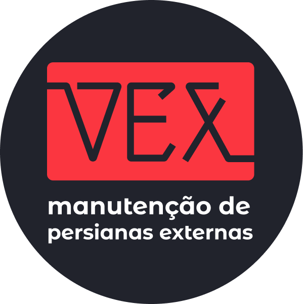
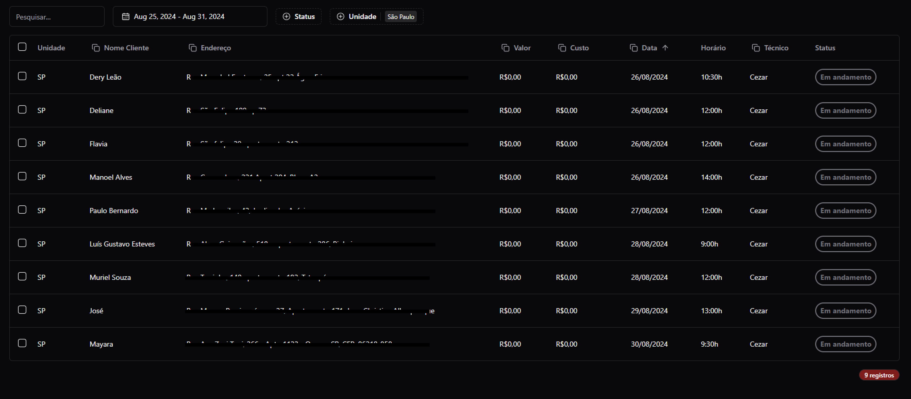
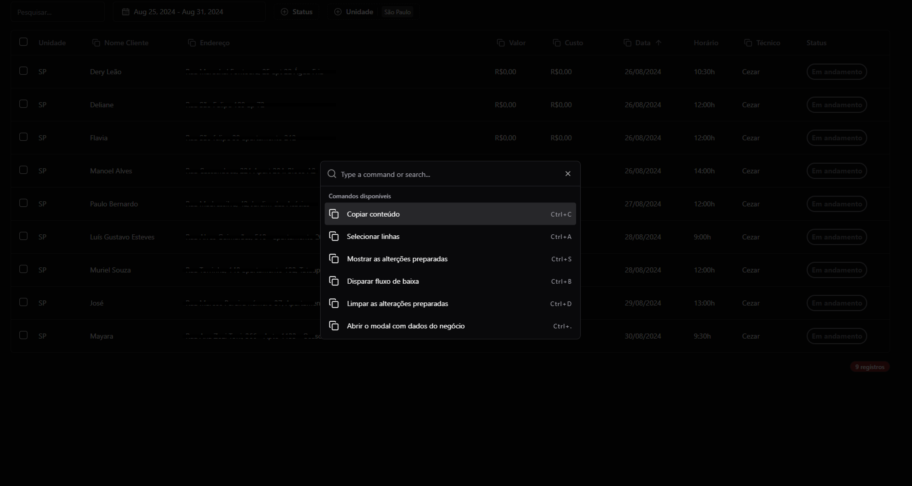
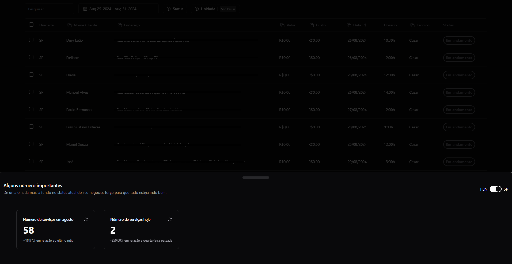

[![LinkedIn][linkedin-shield]][linkedin-url]

<!-- PROJECT LOGO -->
 

  
<h3 align="center">Controle de Agendamentos - Vex Persianas</h3>
  

    Este projeto tem por objetivo apresentar um pouco do resultado e das tecnologias utilizadas no desenvolvimento da aplicação Desktop destinada a visualização e controle de Agendamentos da Vex Persianas.
     
     
  

<!-- ABOUT THE PROJECT -->
## Sobre o Projeto

Desenvolvida utilizando Vite e Tauri React, com TypeScript, a aplicação desktop da Vex foi criada para centralizar a apresentação dos agendamentos semanais e simplificar o controle de contas e agenda. A principal função da aplicação está associada ao processo de dar baixa nas contas ao final de cada semana.

Anteriormente, o processo envolvia a digitação manual dos valores nas células de uma planilha Excel. Agora, com a aplicação, é possível selecionar o período desejado (geralmente semanal), dar baixa nos serviços registrados, associando um valor cobrado e um custo para cada serviço. Com um simples comando, a aplicação copia toda a grade de dados no formato adequado para colar diretamente na planilha do Excel, onde as fórmulas pré-existentes realizam os cálculos necessários para o fechamento.

A aplicação consome dados de um Realtime Database (Firebase), que é compartilhado com a aplicação mobile, garantindo sincronização e consistência entre as plataformas.

(<a href="#readme-top">voltar ao topo</a>)

### Ferramentas e Tecnologias Utilizadas

* [![Vite][Vite]][Vite-url]
* [![React][React.js]][React-url]
* [![Tauri][Tauri]][Tauri-url]
* [![Tailwind][Tailwind]][Tailwind-url]
* [![ShadcnUI][ShadcnUI]][ShadcnUI-url]

(<a href="#readme-top">voltar ao topo</a>)

## Captura de Tela da Página inicial

    
Captura de Tela da página inicial da aplicação apresentando os agendamentos da semana e suas informações.

    
    
Demonstrando a funcionalidade de comandos para navegação e interação com a aplicação.

    
    
Modal apresentando informações básicas de negócio.

    

(<a href="#readme-top">voltar ao topo</a>)

<!-- MARKDOWN LINKS & IMAGES -->
<!-- https://www.markdownguide.org/basic-syntax/#reference-style-links -->
[linkedin-shield]: https://img.shields.io/badge/-LinkedIn-black.svg?style=for-the-badge&logo=linkedin&colorB=555
[linkedin-url]: https://www.linkedin.com/in/leandro-matos-2275521a3/

[Vite]: https://img.shields.io/badge/Vite-ffffff?style=for-the-badge&logo=vite&logoColor=646CFF
[Vite-url]: https://vitejs.dev/

[React.js]: https://img.shields.io/badge/React-20232A?style=for-the-badge&logo=react&logoColor=61DAFB
[React-url]: https://reactjs.org/

[Tauri]: https://img.shields.io/badge/Tauri-fff?style=for-the-badge&logo=tauri&logoColor=24C8D8
[Tauri-url]: https://tauri.app/

[Tailwind]: https://img.shields.io/badge/Tailwind%20CSS-fff?style=for-the-badge&logo=tailwindcss&logoColor=06B6D4
[Tailwind-url]: https://tailwindcss.com/

[ShadcnUI]: https://img.shields.io/badge/Shadcn%20UI-fff?style=for-the-badge&logo=shadcnui&logoColor=000
[ShadcnUI-url]: https://tailwindcss.com/